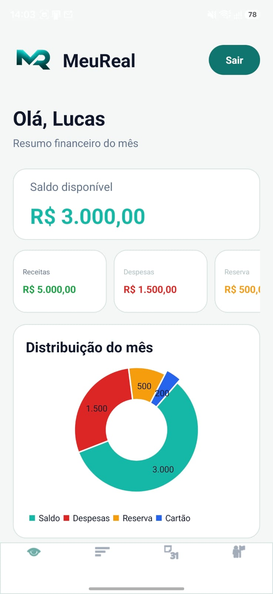
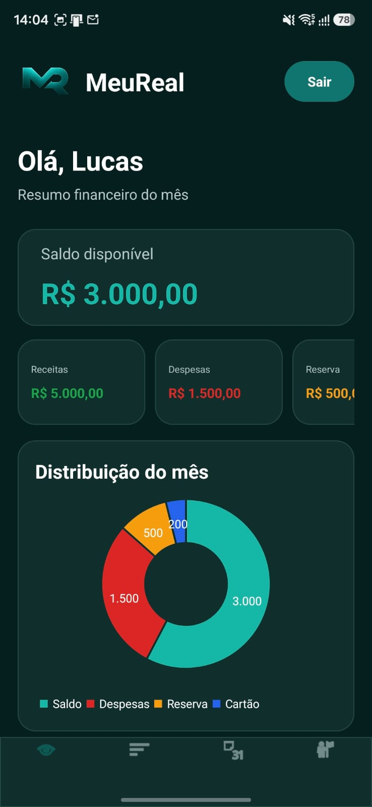
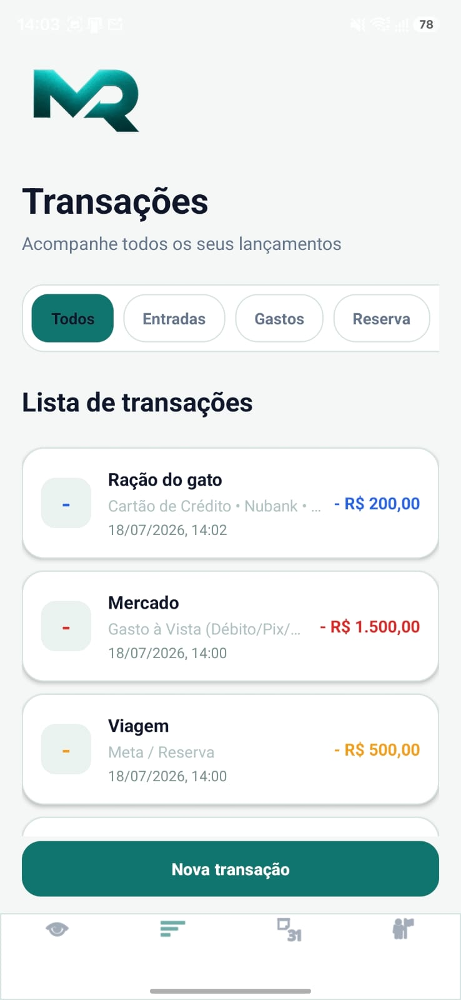
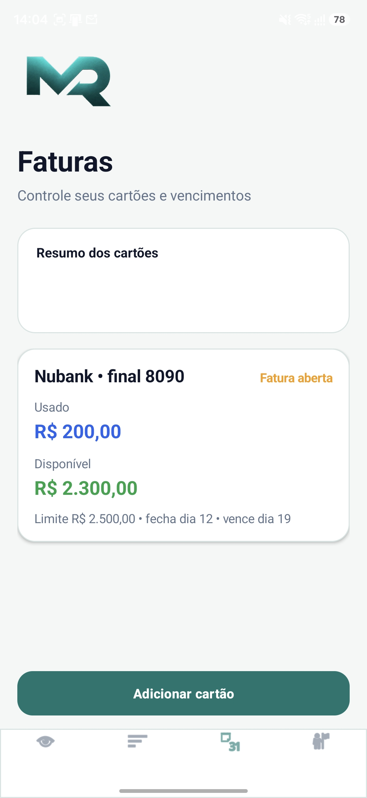
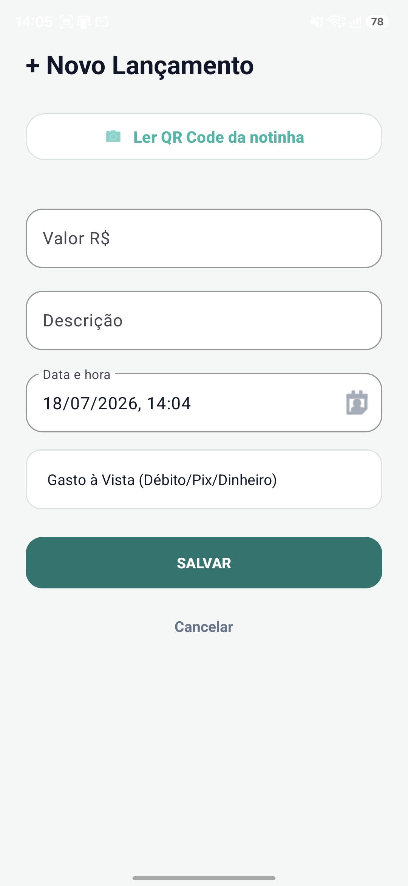

# MeuReal

Aplicativo Android de organização financeira pessoal, desenvolvido para reunir transações, reservas e faturas de cartões em uma experiência simples e visual.

> Projeto autoral de Andreza Pires Alves da Cunha. O código-fonte completo é proprietário e mantido em repositório privado.

## Sobre o projeto

O MeuReal ajuda o usuário a acompanhar sua vida financeira em um único aplicativo. A interface apresenta o saldo disponível, receitas, despesas, reservas e gastos no cartão, além de um gráfico com a distribuição mensal.

O projeto foi desenvolvido nativamente para Android, com Java e layouts XML, mantendo uma identidade visual própria em verde-petróleo e suporte aos temas claro e escuro.

## Principais recursos

- Cadastro, login e sessão de usuários.
- Dashboard com resumo financeiro e gráfico mensal.
- Cadastro, edição, exclusão e filtros de transações.
- Controle separado de receitas, gastos, reservas e resgates.
- Cadastro de diferentes cartões de crédito.
- Controle de limite, fechamento, vencimento e pagamento de faturas.
- Organização de compras parceladas por fatura.
- Leitura de QR Code de notas fiscais para auxiliar o preenchimento de lançamentos.
- Temas claro, escuro e conforme o sistema.
- Edição de perfil e alteração de senha.
- Painel administrativo local.

## Demonstração

Adicione as capturas de tela na pasta `assets` usando os nomes abaixo.

| Tela inicial | Dashboard claro |
| --- | --- |
|  |  |

| Dashboard escuro | Transações |
| --- | --- |
|  |  |

| Cartões e faturas | Novo lançamento |
| --- | --- |
|  |  |

## Tecnologias

- Java
- Android SDK
- XML Views
- Material Components
- Armazenamento local com `SharedPreferences`
- Leitura de QR Code com ZXing/JourneyApps
- Gráficos de distribuição financeira
- Gradle

## Arquitetura atual

Esta versão utiliza dados locais para permitir o funcionamento completo e a validação da experiência do aplicativo. A estrutura de comunicação com API foi preparada para uma futura integração com o servidor do MeuReal.

Por segurança e proteção da propriedade intelectual, este repositório de portfólio não contém:

- código-fonte do aplicativo;
- credenciais ou dados reais de usuários;
- chaves de assinatura;
- arquivos APK ou App Bundle;
- configurações privadas do servidor;
- banco de dados de produção.

## Status

O MeuReal está em desenvolvimento ativo e em preparação para testes de distribuição no Google Play.

Recursos planejados incluem sincronização segura com o servidor, evolução do painel administrativo e melhorias na leitura de notas fiscais.

## Privacidade

O projeto possui uma política de privacidade pública, disponível em:

[Política de Privacidade do MeuReal](https://meureal.app.br/politica-privacidade.php)

## Autoria e direitos

Copyright © 2026 Andreza Pires Alves da Cunha. Todos os direitos reservados.

Este repositório possui finalidade exclusivamente demonstrativa. Não é concedida permissão para copiar, redistribuir, modificar, publicar ou comercializar o projeto, seu código, sua marca ou seus recursos visuais.

O código-fonte completo permanece em repositório privado.

