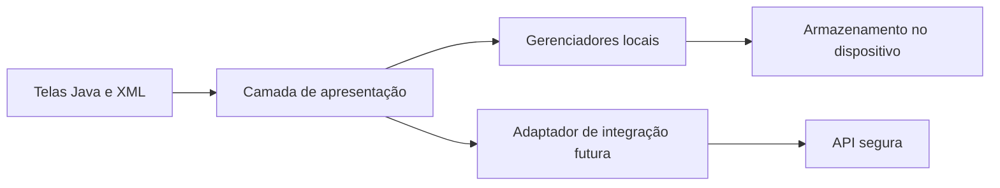

# Arquitetura do MeuReal

O MeuReal é um aplicativo Android de organização financeira desenvolvido em Java e XML. A solução foi estruturada para separar interface, regras da aplicação, persistência local e integração futura com serviços remotos.

## Módulos funcionais

- Autenticação e perfil.
- Dashboard e resumo financeiro.
- Receitas, despesas e reservas.
- Cartões, limites e faturas.
- Parcelamento de compras.
- Leitura de QR Code de nota fiscal.
- Temas claro, escuro e conforme o sistema.
- Área administrativa com acesso controlado.

Este documento apresenta somente a organização conceitual. Nomes internos, regras detalhadas, endpoints e decisões sensíveis permanecem no repositório privado.

